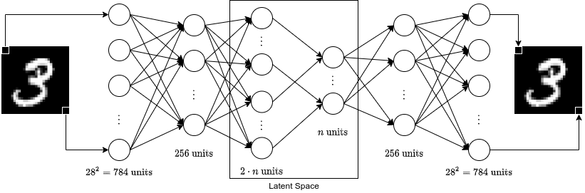
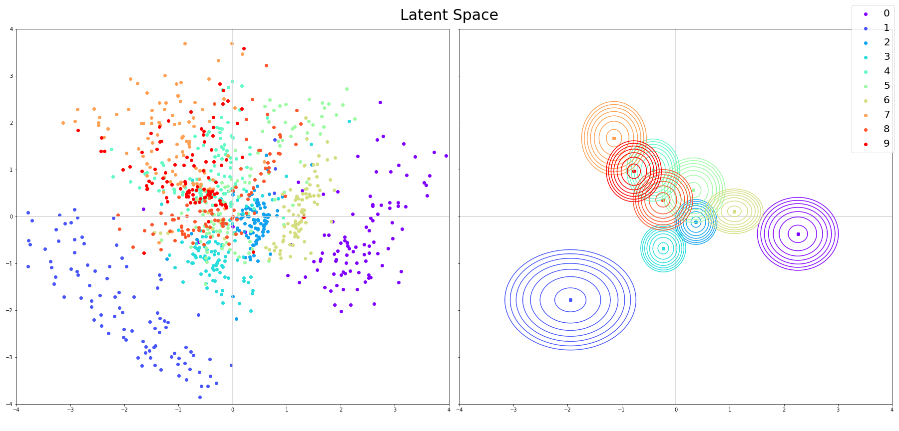
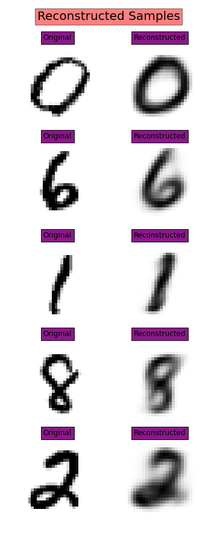
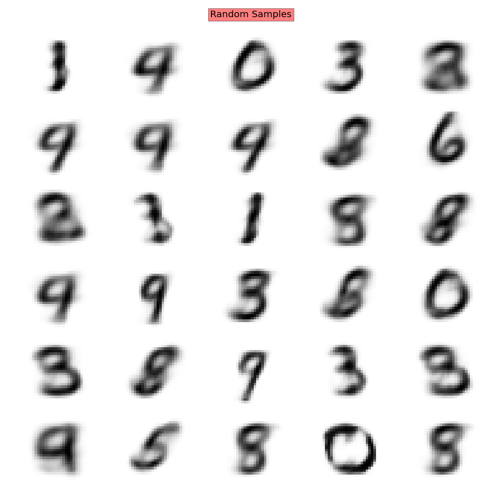
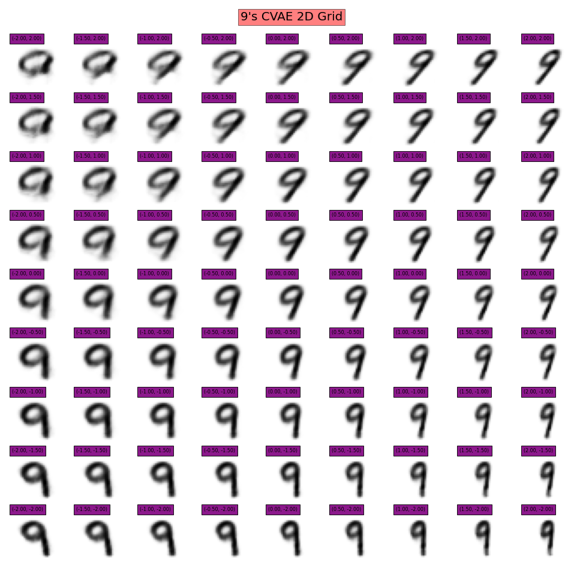

# VAE study for MNIST

This repo contains code used for the results presented in my [Thinking AIoud blogpost](https://thinking-ai-aloud.blogspot.com/2020/11/variational-autoencoders-vae-hands-on.html).

The architecture used is a simple FFNN:

Using a **2D latent space**, we are able to visualize it without distortions from dimensionality reduction:

Using such a VAE to **reconstruct** inputs results in somewhat blurry results:

The result was the same while using the decoder as a generator:

However, that's where the **Conditional VAE** comes to the rescue:

